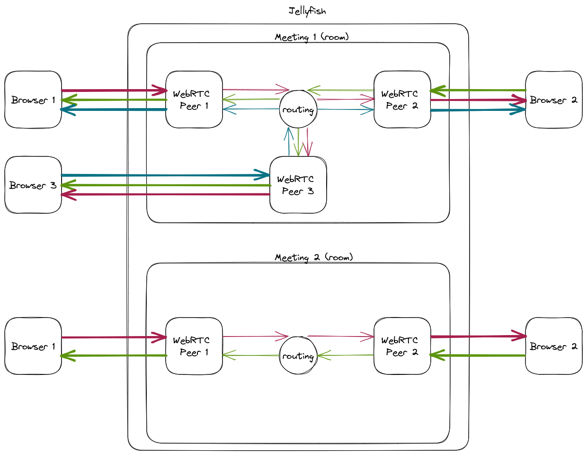

# Jellyfish introduction

## Table of contents

### What Jellyfish is and why it might be useful?
- what we mean by media server
- explain WebRTC, HLS and RTSP
- explain that Jellyfish bridges these

### Features and what's under the hood?
- membrane for multimedia pipelines
- phoenix for api
  - REST with open api
  - protobufs with grafana
  - prometheus metrics
- sdk in different languages
- webrtc implemented with rtc_engine
  - what is membrane
  - our pipelines in rtc_engine
- pipeline for hls
  - compositor
  - phoenix takes care of serving http
- rtsp can receive inbound streams
- load balancing with erlang distribution

- dashboard?
- show how easy the deployment is
- benchmarks

### Example
- two people connected via webrtc
- hls streams is composed and served

- custom or with Dashboard?
- use videoroom, but then add hls endpoint manually with iex to show how easy it is

## Foreword

How many of you have attended the Łukasz talk about Jellyfish?
Who knows what WebRTC, RTSP and HLS are?

In this section I would like to introduce you to Jellyfish, the basic concepts used
by Jellyfish.

Armed with this knowledge we will make our first steps into
development using Jellyfish.

## What is Jellyfish?

Jellyfish is an open-source, general-purpose media server.
It is implemented in Elixir and uses Membrane Framework under the hood.

We created Jellyfish to allow for easy integration implementation of multimedia
applications.

Currently Jellyfish ships with support for WebRTC, RTSP and HLS protocols.
Each of them have different use cases and Jellyfish is a center piece, which
bridges those protocols.

WebRTC (Web Real-Time Communication) is an open-source project that enables real-time communication of audio, video, and data in web browsers and mobile apps via simple APIs, without plugins or external applications. Allows for latency of hundreds of milliseconds.

HLS (HTTP Live Streaming): A protocol developed by Apple for adaptive bitrate streaming over HTTP. It breaks the stream into small chunks, adapting the streaming to the available data rate. Generally used for streaming live events online. Usually has latency of a couple seconds.

RTSP (Real Time Streaming Protocol): A network control protocol used to control streaming media servers, and facilitates real-time control of media streaming between servers and clients. Commands like 'play', 'record', 'pause', are used to control the media sessions.

## Concepts

Since you are participating in a workshop, we would like to give you
a hands on experience with the Jellyfish.
That's why I won't go into much details of Jellyfish.

Now, I would like to outlines Jellyfish building blocks. This will explain
the basic principles of Jellyfish.

Room
In Jellyfish, a room serves as a holder for peers and components, its function varying based on application.

For instance, within a video conferencing system, a Jellyfish room represents a single online meeting or a channel accommodating multiple users for conversation.

On the other hand, in a broadcasting system setting, one room will be a container for two components - one responsible for receiving stream from a streaming host (e.g. via RTMP) and the other one responsible for converting this stream into an HLS playlist ready to be broadcasted via CDN.

Component
A component is a server-side process that publishes or subscribes to tracks. Example components are:

HLS component - subscribes to all other tracks and creates from them an HLS playlist ready to be broadcasted via CDN
RTSP component - connects to the remote media source (e.g. an IP camera) and publishes its media to be consumed by other components or peers
Peer
A peer is a client-side entity that connects to the server to publish, subscribe or publish and subscribe to tracks published by components or other peers. The peer's process is spawned after the peer connects to the server. At the moment, there is only one type of peer - WebRTC.

## Example Usage

Now we would like to give you two usage examples of Jellyfish.
These are a couple of hypthetical usage scenarios in which
Jellyfish would come to fruition.

### Scenario 1

In this scenario we have a couple participants, who want to have an online video meeting.
This is a very popular case, in fact we have our meeting platform, which we use for
internal meetings. 
Such scenario is really easy to setup using Jellyfish.

If we want to we could easily add possibility to save the video to HLS format
and save to later access it.

### Scenario 2

An online entrepreneurship workshop uses a virtual platform supporting audio,
video, WebRTC, and RTSP.
Participants use WebRTC for interactive discussions. An RTSP-enabled camera,
located remotely at a manufacturing unit, streams a live product demo.
This RTSP stream is integrated into the meeting, allowing all participants
to view the demo in real-time, thereby enriching the workshop experience.

## Developing with Jellyfish

We have a bunch of SDKs for Jellyfish development.
React, React Native, TypeScript, Android and IOS client SDKs
and Elixir and Python server SDKs.

### Server SDKs

The server SDKs are Rest API wrappers, which allow for managing Jellyfish state,
e.g. creating rooms, adding peers, creating components
and deleting them as well.

Server SDKs also allow for subscribing to server notifications, which are
real-time updates from the Jellyfish about change in the state.

### Client SDKs

Client SDKs allow you to connect to Jellyfish to publish and consume video and audio tracks.
Given an authentication token, client SDK can join a room, publish audio, video or screenshare.
It can recieve those as well.

Currently only WebRTC peer is available.

All of them and more are available in the [Jellyfish docs](https://jellyfish-dev.github.io/jellyfish-docs/getting_started/sdks)

## Outro

Now we will head to the practical part. I hope once you play for a bit with the API
and get to know how the Jellyfish works, you will come up with your own ideas
on how to utilize Jellyfish.
